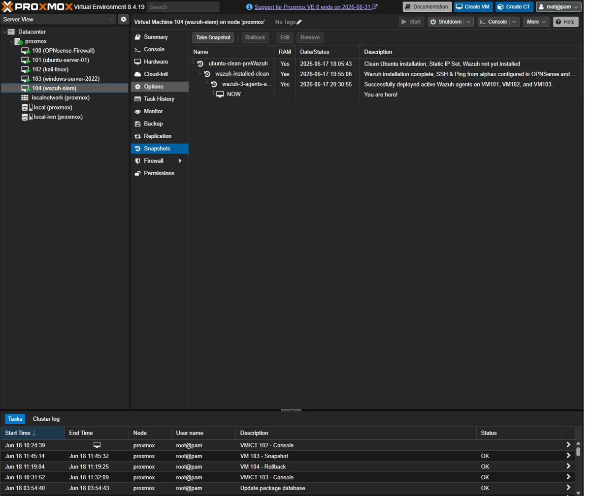
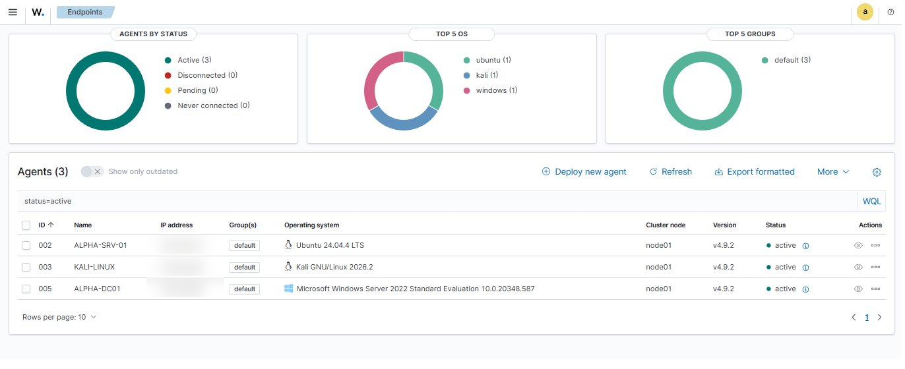
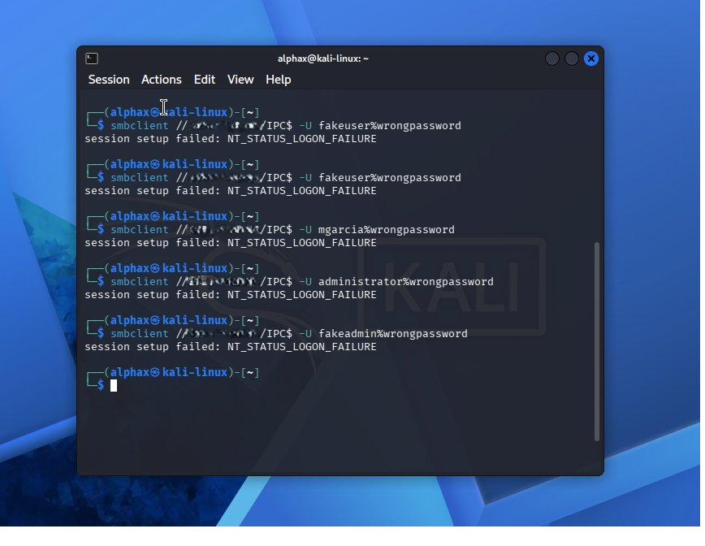
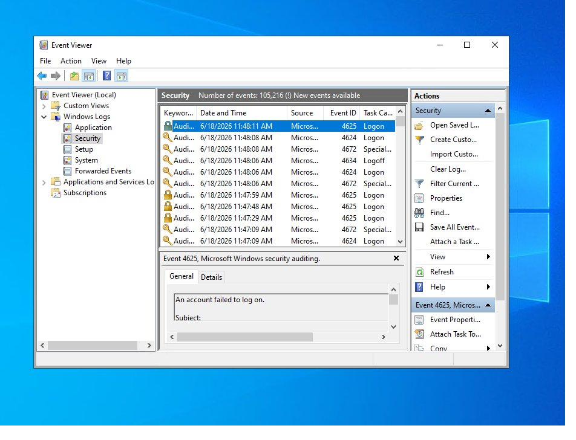
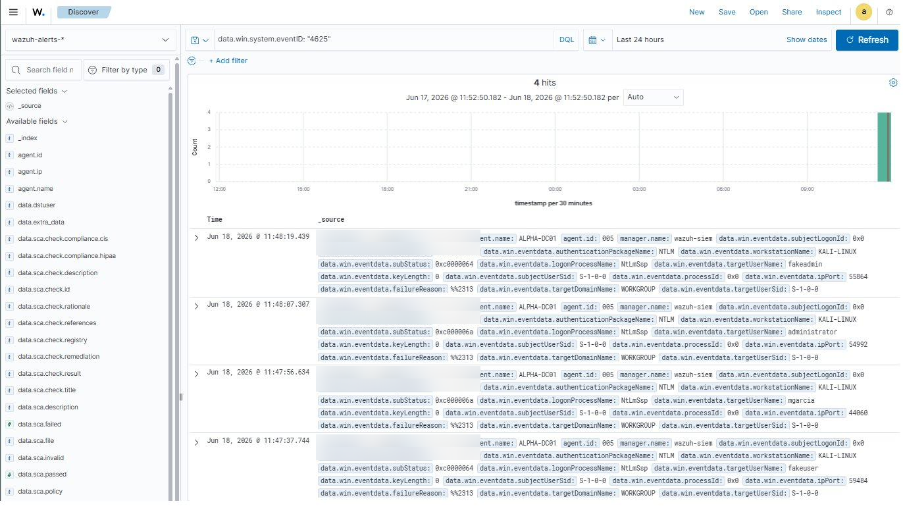
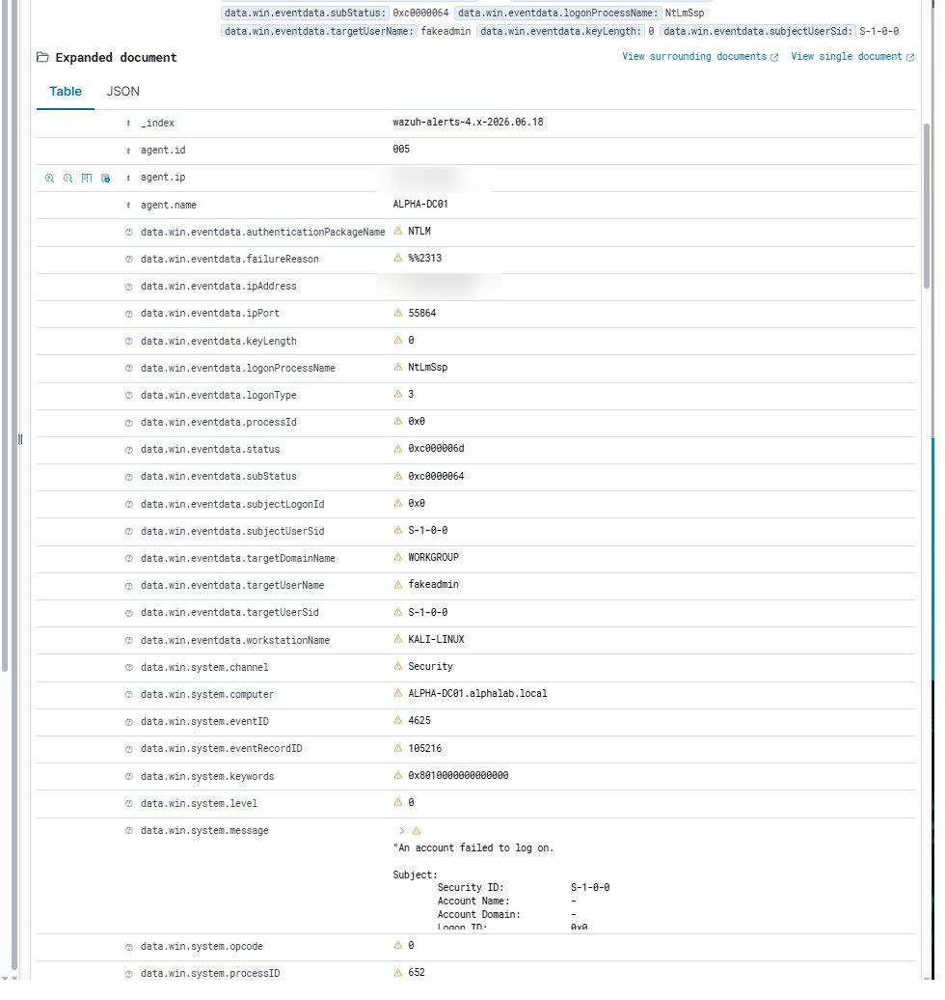

# Phase 7b - Wazuh SIEM Deployment 👁️

With the core lab infrastructure fully operational -- OPNsense routing traffic, a domain controller running alphalab.local, and Kali and Ubuntu VMs domain-joined and reachable -- the next step was deploying a Security Information and Event Management platform. That platform is Wazuh.

This phase covers everything from VM creation through agent deployment and first live attack detection.

---

## Why Wazuh

A SIEM is the operational core of a SOC. It collects logs from every system in the environment, normalizes them into a consistent format, correlates events across sources, and fires alerts when something suspicious matches a detection rule.

Wazuh was chosen over Splunk for the homelab for one practical reason: no ingestion cap. Splunk's free tier limits log ingestion to 500MB per day -- a constraint that becomes a real problem once agents are running on multiple VMs and generating continuous event streams. Wazuh is fully open-source with no data limits, making it the right choice for a training environment where generating volume is part of the point.

That said, the skills transfer directly. Both platforms share the same core SOC workflow: filter by agent, sort by severity, read the description, expand the raw log, understand what happened. Wazuh is being added to the resume alongside Splunk as a separate tool, not a substitute.

---

## VM 104 - wazuh-siem

A dedicated VM was created in Proxmox to host the Wazuh stack. Wazuh ships as an all-in-one installer that deploys the manager, OpenSearch indexer, and web dashboard on a single host -- appropriate for a lab environment.

| Setting | Value |
|---|---|
| VM ID | 104 |
| Name | wazuh-siem |
| OS | Ubuntu Server 24.04 LTS |
| CPU | 4 cores (Host type) |
| RAM | 8192 MB |
| Disk | 50GB VirtIO, cache=writeback, iothread=on |
| Network | vmbr1 (isolated lab LAN) |
| Static IP | 172.16.0.50/24 |
| Gateway | 172.16.0.1 |
| DNS | 172.16.0.30 (ALPHA-DC01), 8.8.8.8 (fallback) |

Ubuntu was installed with the full server base, OpenSSH enabled during setup, and no snaps selected. After install, the LVM logical volume was expanded to consume the full 50GB disk.

---

## Static IP Configuration

Wazuh agents need a stable address to connect to. Ubuntu Server 24.04 uses Netplan for network configuration. The file at `/etc/netplan/50-cloud-init.yaml` was edited directly:

    network:
      version: 2
      ethernets:
        ens18:
          dhcp4: no
          addresses:
            - 172.16.0.50/24
          routes:
            - to: default
              via: 172.16.0.1
          nameservers:
            addresses:
              - 172.16.0.30
              - 8.8.8.8

Applied with `sudo netplan apply` and verified with `ip addr show ens18`.

---

## OPNsense Firewall Rules

Four new firewall rules were added to the WAN ruleset in OPNsense, following the same per-VM pattern established for ALPHA-SRV-01 and KALI-LINUX:

| Protocol | Source | Destination | Port | Description |
|---|---|---|---|---|
| IPv4 ICMP | XFlow | 172.16.0.50 | * | Allow XFlow ping to Wazuh |
| IPv4 TCP | XFlow | 172.16.0.50 | 22 | Allow XFlow SSH to Wazuh |
| IPv4 TCP | XFlow | 172.16.0.50 | 443 | Allow XFlow HTTPS to Wazuh dashboard |
| IPv4 TCP | XFlow | 172.16.0.50 | 80 | Allow XFlow HTTP to Wazuh |

HTTPS on port 443 is the primary dashboard access port. HTTP on port 80 redirects to 443 but the rule was included to avoid a confusing connection refused error on the rare occasion the redirect is bypassed.

---

## Installing Wazuh

Wazuh 4.9.2 was installed using the official all-in-one assisted installer script:

    curl -sO https://packages.wazuh.com/4.9/wazuh-install.sh && sudo bash wazuh-install.sh -a

The `-a` flag installs all components on a single node: Wazuh manager (the engine that receives and processes agent data), OpenSearch indexer (stores and indexes all events), and the web dashboard (the UI for searching, visualizing, and alerting).

The installer handles all dependencies, generates TLS certificates, and starts all three services automatically. Total install time was roughly 10-15 minutes.

**Dashboard access:**
- URL: `https://172.16.0.50`
- Username: `admin`
- The installer generates a randomized password and displays it at the end -- this was saved securely

---

## Snapshot Discipline

Three snapshots were taken throughout the process, each serving a specific recovery purpose:

| Snapshot | Timing | Purpose |
|---|---|---|
| `ubuntu-clean-preWazuh` | After static IP, before Wazuh install | Roll back if install corrupts the base OS |
| `wazuh-installed-clean` | After Wazuh install, before agents | Roll back if agent enrollment breaks the manager |
| `wazuh-3-agents-active` | After all three agents confirmed active | Clean known-good state with everything working |

This three-checkpoint pattern -- before install, after install, after validation -- is the standard discipline now applied to every major change in the lab.

---

## Deploying Wazuh Agents

Wazuh uses a manager-agent architecture. The manager runs on the SIEM VM and agents run on every system being monitored. Agents collect logs, run file integrity checks, detect configuration drift, and forward all of it to the manager in real time.

Agents were deployed on all three lab VMs.

### ALPHA-DC01 - Windows Server 2022 (Agent 001)

On Windows, the Wazuh agent is distributed as an MSI installer. The agent was downloaded and installed via PowerShell, with the manager address and agent name specified as parameters:

    Invoke-WebRequest -Uri "https://packages.wazuh.com/4.x/windows/wazuh-agent-4.9.2-1.msi" -OutFile wazuh-agent.msi
    Start-Process msiexec.exe -ArgumentList '/i wazuh-agent.msi /q WAZUH_MANAGER="172.16.0.50" WAZUH_AGENT_NAME="ALPHA-DC01"' -Wait
    NET START WazuhSvc

### ALPHA-SRV-01 - Ubuntu Server 24.04 (Agent 002)

On Ubuntu, the agent was installed as a .deb package:

    wget https://packages.wazuh.com/4.x/apt/pool/main/w/wazuh-agent/wazuh-agent_4.9.2-1_amd64.deb
    sudo WAZUH_MANAGER='172.16.0.50' WAZUH_AGENT_NAME='ALPHA-SRV-01' dpkg -i wazuh-agent_4.9.2-1_amd64.deb
    sudo systemctl enable wazuh-agent && sudo systemctl start wazuh-agent

### KALI-LINUX - Kali GNU/Linux (Agent 003)

Identical process to ALPHA-SRV-01, with the agent name set accordingly:

    sudo WAZUH_MANAGER='172.16.0.50' WAZUH_AGENT_NAME='KALI-LINUX' dpkg -i wazuh-agent_4.9.2-1_amd64.deb
    sudo systemctl enable wazuh-agent && sudo systemctl start wazuh-agent

---

## All Three Agents Active

With all three agents enrolled and running, the Wazuh dashboard confirmed green status across the board.

The Endpoints Summary showed exactly the right breakdown: Ubuntu (1), Kali (1), Windows (1). This was the first confirmation that the full monitoring layer was operational.

---

## First Live Alerts - SCA Scans

Within minutes of agents connecting, Wazuh began generating Security Configuration Assessment alerts without any manual trigger. SCA is Wazuh's automated compliance checker. It runs a series of checks against each VM and flags anything that deviates from hardening benchmarks.

The DC was running the CIS Windows Server 2022 benchmark -- 359 individual checks. The Linux VMs were running the CIS Unix audit. Every failed check generates an alert. Most of these are expected in a lab environment: password complexity not meeting CIS standards, audit policy gaps, services running that a hardened server wouldn't have. This is a feature, not a problem -- seeing what a real hardening gap looks like is exactly why the lab exists.

SCA alerts are distinct from log-based alerts. SCA findings tell you about the configuration state of a system (what it looks like at rest). Log-based alerts tell you about things that actually happened (events in motion). Both matter in a real SOC.

---

## Windows Event Logs Flowing

Windows Security Event logs from ALPHA-DC01 confirmed flowing into Wazuh immediately: Event ID 4624 (successful logon), 4634 (logoff), and 4672 (special privileges assigned to logon) were all appearing in the Discover view.

The DC was generating significant event volume just from normal AD activity -- domain authentication, Kerberos ticket grants, service account logons -- which is exactly what makes a DC such a high-value log source in a real environment.

---

## First Attack Simulation - SMB Logon Failures

To verify the detection pipeline end-to-end, deliberate failed authentication attempts were generated from Kali using `smbclient` against the DC.

The commands intentionally used wrong passwords against multiple account names -- including fake accounts that don't exist in the domain at all -- to generate a variety of failure conditions.

Each failed authentication should generate a Windows Event ID 4625 -- an account failed to log on.

---

## Confirming 4625 in Windows Event Viewer

Before checking Wazuh, Event Viewer on ALPHA-DC01 confirmed the failures were being logged directly by Windows. The Security log showed the 4625 events appearing alongside the expected pattern of surrounding events.

---

## Confirming 4625 in Wazuh

The same events confirmed visible in Wazuh using the Discover view with a filter on `data.win.system.eventID: "4625"`.

The expanded document view shows the full event structure -- agent name, workstation name, target username, authentication package, failure reason codes. This is the raw forensic data a SOC analyst would use to reconstruct exactly what happened.

---

## Reading a 4625 Alert - The Analyst View

Expanding one of the 4625 events in Wazuh reveals the full field breakdown:

Key fields to read in a 4625 event:

- `data.win.eventdata.targetUserName` - the account that was targeted. In this case, fake test accounts like fakeuser, fakeadmin, mgarcia, administrator.
- `data.win.eventdata.workstationName` - where the attempt came from. KALI-LINUX, as expected.
- `data.win.eventdata.authenticationPackageName` - NTLM here, which means the authentication bypassed Kerberos. A real attacker might deliberately use NTLM to avoid Kerberos logging.
- `data.win.eventdata.subStatus` - the specific failure reason code. `0xc0000064` means the username doesn't exist. `0xc000006a` means the password was wrong for a valid account. These two codes together tell a different story than either one alone.

The `subStatus` codes are something every SOC analyst needs to memorize. A spray of `0xc0000064` failures means the attacker is enumerating usernames -- they don't have a valid list yet. A mix of `0xc0000064` and `0xc000006a` means they found some valid accounts and are now password spraying. The pattern tells you where the attacker is in their kill chain.

---

## What's Next

The detection pipeline is live. The next phase builds on this foundation:

- Run a proper nmap scan from Kali and watch Wazuh catch the recon activity
- Trigger account lockout with repeated failures and observe Event ID 4771 (Kerberos pre-authentication failure)
- Deploy Security Onion for network-level detection to complement Wazuh's host-level coverage
- Deploy Metasploitable 3 as a dedicated vulnerable target for structured exploitation practice
